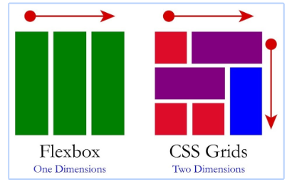
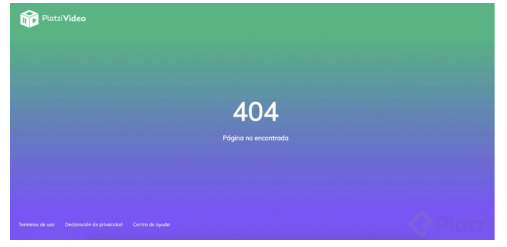

# Reto 1 Pagina404

El reto consiste en que crees una pagina 404, si estas haciendo el proyecto de la escuela de javascript de platzi, puedes crearla para platzi video. Si no, para cualquier otro proyectos.

## Recomendaciones

realiza un fork al proyecto y ejecuta el reto, despues envia un pull recquest con la solucion.

### El curso recomendado para el reto de platzi es:

https://platzi.com/cursos/frontend-developer/

### Algunas URL de interes
https://css-tricks.com/snippets/css/complete-guide-grid/
https://css-tricks.com/snippets/css/a-guide-to-flexbox/
https://developer.mozilla.org/es/docs/Web/CSS/grid

### Recueda 

### te dejo algunas url de ejercicios que te ayudaran a resolver el reto

https://cssgridgarden.com/#es
https://flexboxfroggy.com/#es
http://www.flexboxdefense.com/

## Condiciones:

[] Debes utilizar Display Grid o Flex para acomodar los elementos
[] Debe ser responsive la pagina (verse bien en cualquier dispositivo)

## Ejemplo

